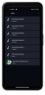

# Barts Music Player App

Barts Music Player is a sleek and intuitive music player app built with Flutter. With its stylish design and powerful features, it provides an immersive music listening experience for users. Whether you're a casual listener or a music enthusiast, Barts has got you covered!

## Screenshots

## Download

Get started with Barts Music Player today! Click the link below to download the app:

[Download Barts Music Player](https://drive.google.com/file/d/1ZNQwUA_5O-nRjj8Ftjv7Qkep00Hy3sEO/view?usp=drive_link)

Feel free to explore the features, enjoy your favorite tracks, and let the music take you on a journey!

## Feedback

We value your feedback! If you have any suggestions, bug reports, or feature requests, please don't hesitate to reach out to us. You can contact our support team at support@bartsplayer.com or visit our website at [www.bartsplayer.com](https://www.bartsplayer.com).

Thank you for choosing Barts Music Player! We hope you enjoy using our app as much as we enjoyed creating it. Happy listening!